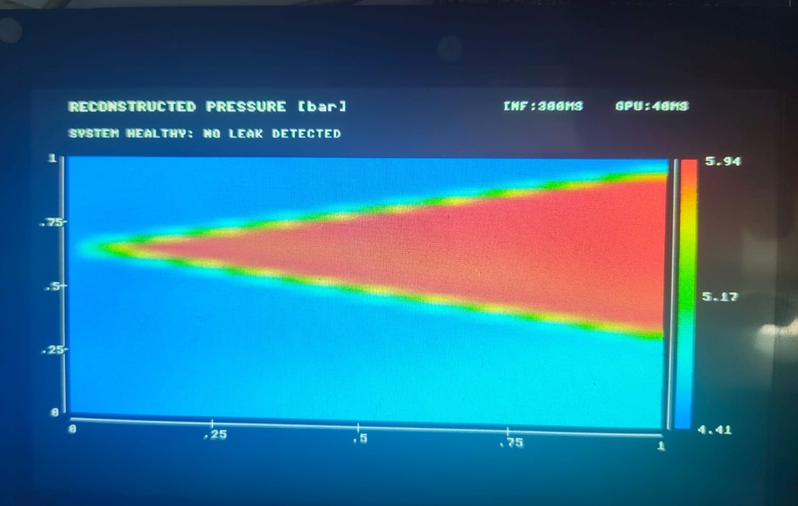
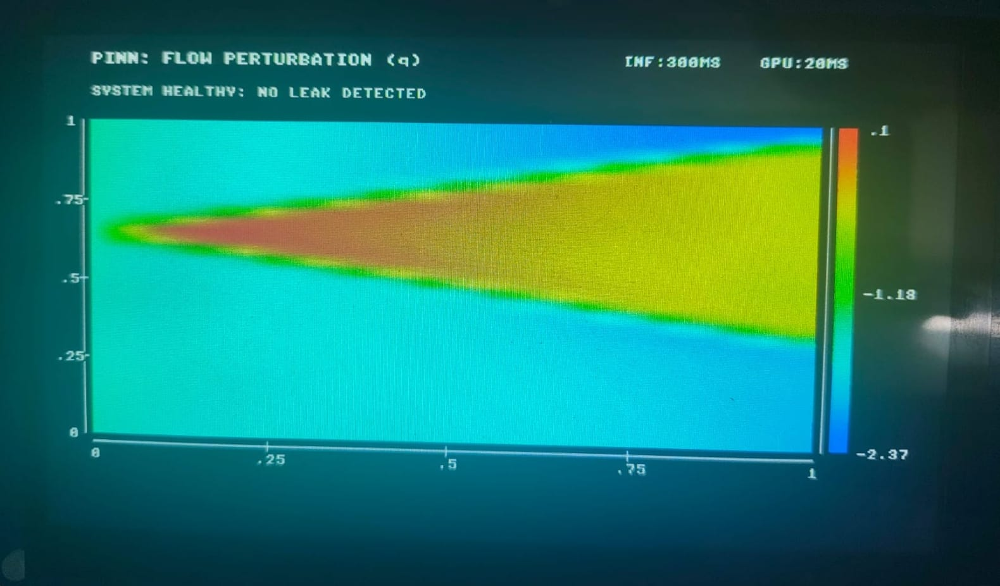

# PINN Embedded Anomaly Pipeline

> **Physics-Informed Neural Network Pipeline for Transient Pressure/Flow Monitoring and Anomaly Detection on Renesas EK-RA8P1 (ARM Cortex-M85)**
> *TRON Programming Contest 2026 Submission — AI Application Category*

[](LICENSE)
[](https://www.tron.org/)
[](https://www.renesas.com/)
[](https://www.arm.com/)
[](https://www.tensorflow.org/lite/microcontrollers)

---

## Overview

This project deploys a two-model, fully edge-computed pipeline for **pressurized-pipe transient monitoring**: it reconstructs the pressure/flow field along a pipe and independently detects/localizes a **leak** or **constriction (partial blockage)** from two pressure sensors, with no cloud component.

Two TFLite Micro models run under μT-Kernel 3.0 on the RA8P1:

1. **Flow/head model** (2 inputs) — reconstructs the pressure/flow background field over normalized pipe position and time.
2. **Anomaly classifier** (206 inputs, 6 outputs) — identifies `NONE` / `LEAK` / `CONSTRICTION` and estimates location + class-specific severity from live sensor data.

```text
   TWO PRESSURE SENSORS
            |
            v
   206 FEATURE VECTOR --------> 206->6 CLASSIFIER --> NONE / LEAK / CONSTRICTION
                                                              |
                                                     location + severity
                                                              |
Normalized (xi,tau) -----> FLOW/HEAD MODEL                    |
            |                        |                        |
            v                        v                        v
        [h, q]  ---->  H(xi,tau), P(xi,tau)  ---->  ANOMALY-ANNOTATED PRESSURE MAP
```

The two models are **not chained** — the classifier's output is overlaid as an annotation on the flow/head model's field, not used to re-solve the PDE. The result is a **1D pipe-space × time map** `P(x,t)`, not a 2D CFD field.

---

## Development & Build Environment

- **Microcontroller Board:** Renesas EK-RA8P1
- **Target MCU:** R7KA8P1KFLCAC (Cortex-M85 / CPU0)
- **RTOS:** μT-Kernel 3.0
- **IDE:** Renesas e2 studio
- **Flexible Software Package (FSP):** v6.5.0 (provides the TensorFlow Lite for Microcontrollers inference component used to run both models)
- **Toolchain:** GCC ARM Embedded 13.2.1.arm-13-7
- **CMSIS Component:** Arm CMSIS Version 6 - Core (M) v6.1.0+fsp.6.5.0
- **Model development/training (host-side only, not on-device):** Python, PyTorch, DeepXDE, ONNX, ONNX Runtime, TensorFlow (for ONNX→TFLite conversion)

---

## 1. Methodology

Both models are trained against a **Method-of-Characteristics (MOC)** solution of the 1-D water-hammer equations (transient continuity + momentum on a pressurized pipe with a controlled valve closure) as physics ground truth, then exported to fp32 TensorFlow Lite for on-device inference — no cloud round-trip at inference time.

### 1.1 Flow/head model — pressure/flow field reconstruction

| | |
|---|---|
| Architecture | `Linear(2→32) → Tanh → Linear(32→32) → Tanh → Linear(32→32) → Tanh → Linear(32→2)` |
| Parameters | 2,274 |
| Input | `[xi, tau]`, float32 `[1,2]`, where `xi = x/L` (position), `tau = a_nom·t/L` (time) |
| Output | `[h, q]`, float32 `[1,2]` — dimensionless head/flow perturbation, hard-constrained to satisfy the reservoir boundary condition and a zero initial state |

**Physical reconstruction** (downstream of the model, fixed per deployed scenario):
```
H_ss(xi) = H2_0 + (H1_0 - H2_0)/(1-xi1) · (1-xi)      -- steady baseline profile
H(xi,tau) = H_ss(xi) + Hs · h(xi,tau)                  -- Hs = 10 m (fixed scale)
P(xi,tau) = rho * g * H(xi,tau)                        -- pascals; /1e5 for bar
```
The model does **not** output pressure directly — `h` is a dimensionless perturbation rescaled through the reconstruction above.

**Accuracy vs. MOC ground truth**, measured on the exact architecture that is exported and deployed:

| Metric | Value |
|---|---:|
| H field NRMSE | 1.93% |
| Q field NRMSE | 2.45% |
| Q relative error | 0.457% |
| H sensor RMSE | 0.144 m |
| Export fidelity (PyTorch f64 vs. ONNX f32) | max diff 3.6e-6 |

Full metrics: `2input_forward_pinn_metrics.json`.

### 1.2 Anomaly classifier — NONE / LEAK / CONSTRICTION

| | |
|---|---|
| Architecture | shared tanh trunk (96 wide × 3 deep) → class softmax + position + severity heads |
| Parameters | 39,078 |
| Model size | 162,248 bytes (fp32) |
| Input | `[1,206]` float32 — 2×100 resampled sensor perturbation traces + 6 scalar pipe/baseline features |
| Output | `[1,6]` float32: `[p_none, p_leak, p_constriction, xi_frac, kappa_leak, kappa_constriction]` |

**Feature layout** (206 inputs):
```
[0:100]    sensor 1 (near reservoir) resampled head-perturbation trace
[100:200]  sensor 2 (at valve) resampled head-perturbation trace
[200]      log(phi)      -- dimensionless friction number
[201]      H1_0 / 100    -- pre-transient baseline head, sensor 1
[202]      H2_0 / 100    -- pre-transient baseline head, sensor 2
[203]      log(B_nom)    -- pipe impedance a_est/(g·A)
[204]      log(qv0)      -- B_nom · Q_design
[205]      xi1           -- sensor-1 position / L
```

Class = `argmax(p_none, p_leak, p_constriction)`. Use `xi_frac · L` for position and `kappa_leak`/`kappa_constriction` for severity **only** when the corresponding class was predicted — the unused heads are not meaningful for other classes. Physical conductance: `CdA = kappa / (B_nom · sqrt(2g))`.

**Accuracy**, measured on 300 held-out cases (disjoint from the 20,000-example training set) and cross-checked on an independent 100-case test set:

| Set | n | Accuracy |
|---|---:|---:|
| Held-out | 300 | 85.3% |
| Independent test set | 100 | 86.0% |

**Confusion matrix (held-out, n=300):**

| True \\ Pred | none | leak | constriction |
|---|---:|---:|---:|
| **none** | 76 | 5 | 12 |
| **leak** | 6 | 87 | 3 |
| **constriction** | 16 | 2 | 93 |

| Class | Precision | Recall | F1 |
|---|---:|---:|---:|
| none | 0.776 | 0.817 | 0.796 |
| leak | 0.926 | 0.906 | 0.916 |
| constriction | 0.861 | 0.838 | 0.849 |

Leak vs. constriction are almost never confused with each other (3 and 2 cases) — the dominant error mode is faint constrictions near the sensor noise floor being called `none`. Localization (correct-class cases only): median 13.6 m, MAE 23.4 m. Confusion-matrix image: `anomaly_classifier_confusion_matrix.png`.

---

## 2. Embedded Execution Order

1. Capture synchronized pressure samples from both sensors; retain pre-transient window; convert to hydraulic head.
2. Compute `H1_0`, `H2_0`; subtract steady baselines; estimate wave speed `a_est`.
3. Resample both traces to the 100-point normalized-time grid; compute `phi`, `B_nom`, `qv0`, `xi1`; assemble the 206-float vector.
4. Run the anomaly classifier; select class via argmax; read position/severity only for the predicted class.
5. Generate the normalized `(xi, tau)` display grid; run the flow/head model; reconstruct `H(xi,tau)`/`P(xi,tau)`.
6. Render the pressure map; overlay the anomaly marker only if class ≠ `NONE`.

**Recommended display resolution:** `Nx=32, Nt=16` (512 flow/head-model evaluations) for small displays; `Nx=64, Nt=24` (1,536 evaluations) for larger ones.

---

## 3. Hardware Validation

> **Both deployed TFLite Micro models have been executed and validated on the target embedded hardware** (Renesas EK-RA8P1, Cortex-M85), confirming successful on-device deployment and inference beyond desktop/ONNX validation.

| Component | Hardware status |
|---|---|
| Flow/head model | Validated on hardware |
| Anomaly classifier | Validated on hardware |
| End-to-end inference pipeline | Hardware validated |

Latency, peak tensor-arena usage, and achieved frame/update rate should be reported separately once exact on-board measurements are logged.




---

## 4. Third-Party Software Disclosures (Section 2.3 Compliance)

In accordance with Rule 2.3 of the TRON Programming Contest 2026, the following existing third-party software components are utilized in this project:

| Component / Software | Rights Holder | Method of Acquisition | Function / Usage | License Notice |
|---|---|---|---|---|
| **μT-Kernel 3.0 (BSP2)** | TRON Forum | Provided by Contest Secretariat / Official Repository | Real-Time Operating System core & BSP | T-License 2.2 |
| **Renesas FSP (v6.5.0)** | Renesas Electronics Corp. | Renesas e2 studio installer | Hardware initialization, board support, and TensorFlow Lite for Microcontrollers inference component | BSD-3-Clause |
| **ARM CMSIS Core (v6.1.0)** | Arm Limited | Included in Renesas FSP / GCC Toolchain | Cortex-M85 core headers | Apache-2.0 |
| **TensorFlow Lite for Microcontrollers** | Google LLC / The TensorFlow Authors | Bundled via the Renesas FSP inference component (see above) | On-device inference runtime for both models | Apache-2.0 |

> **Intellectual Property Guarantee:** The author guarantees that all copyrights and third-party software rights have been handled in accordance with the TRON Programming Contest 2026 application rules.

---

## License

This project is released under the **MIT License**. See the `LICENSE` file for details.
